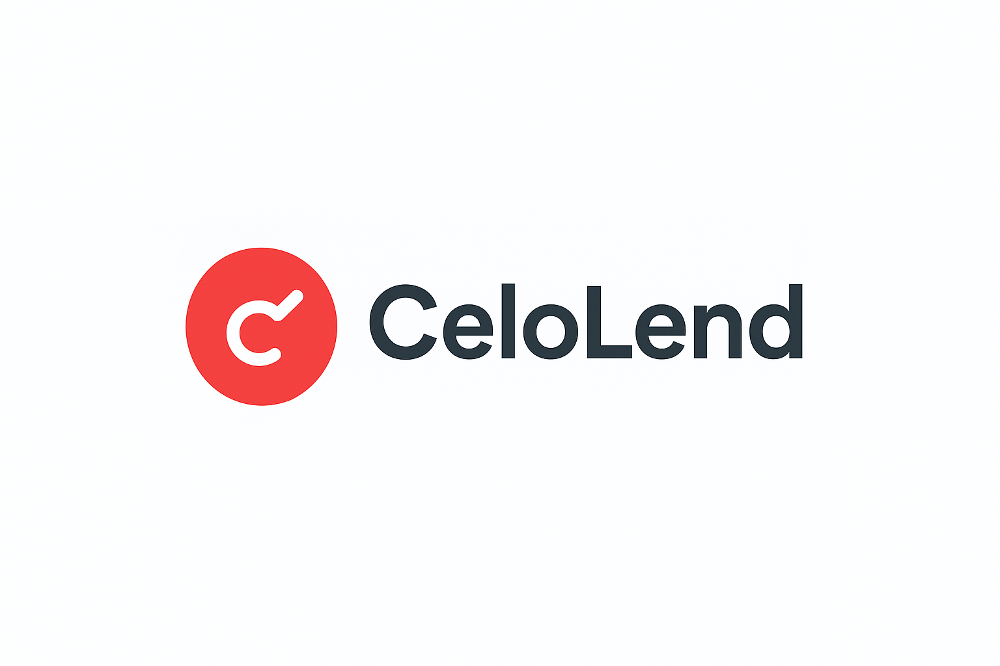

# CELOLEND


A decentralized peer-to-peer lending platform built on Celo that uses Self Protocol for identity verification and algorithmic interest rate models.

## Mission

To democratize access to credit by creating a transparent, fair, and inclusive lending ecosystem where verified users can access capital without traditional banking barriers, while lenders earn competitive returns through intelligent risk assessment.

## The Problem

### Traditional Lending Challenges

- **Exclusion**: 1.7 billion people globally lack access to traditional banking services
- **High Barriers**: Credit checks, collateral requirements, and geographic restrictions limit access
- **Opaque Pricing**: Hidden fees and arbitrary interest rates create uncertainty
- **Centralized Risk**: Single points of failure and institutional bias
- **Limited Transparency**: Borrowers and lenders can't verify loan terms or risk assessment

### DeFi Lending Issues

- **Sybil Attacks**: Fake identities and multiple accounts manipulate lending pools
- **No Credit History**: All borrowers treated equally regardless of repayment history
- **Volatile Rates**: Unpredictable interest rates based purely on supply/demand
- **Collateral Requirements**: High collateral ratios exclude many potential borrowers

## The Solution

### Self Protocol Integration

- **Verified Identity**: Privacy-preserving passport verification prevents Sybil attacks
- **Trust Network**: Real-world identity creates accountability and reduces fraud
- **Global Access**: Anyone with a passport can participate, regardless of location

### Algorithmic Interest Rate Model

- **Risk-Based Pricing**: Interest rates reflect actual borrower risk and credit history
- **Market Equilibrium**: Dynamic rates balance supply and demand automatically
- **Transparent Calculation**: All factors visible and verifiable on-chain

### Decentralized Architecture

- **P2P Matching**: Direct borrower-lender connections without intermediaries
- **Smart Contract Security**: Automated loan management and collateral protection
- **Celo Integration**: Fast, low-cost transactions with mobile-first design

## Overview

This platform enables verified users to lend and borrow CELO and mento stablecoins with dynamic interest rates based on credit scores and collateral. Users verify their identity through Self Protocol's privacy-preserving passport verification.

## Key Features

- **Identity Verification**: Self Protocol integration for Sybil-resistant lending
- **Algorithmic Interest Rates**: Dynamic pricing based on credit scores and market conditions
- **Collateral Support**: CELO and mento stablecoins
- **On-Chain Credit Scoring**: Build reputation through successful loan repayments
- **P2P Marketplace**: Direct borrower-lender matching
- **Modern UI**: Next.js frontend with responsive design

## Smart Contracts

### Core Contracts

- `Lock.sol` - Basic time-locked contract (placeholder for main lending contract)
- `CeloLend.sol` - Main lending contract with Self Protocol integration (planned)
- `LoanAgreement.sol` - Individual loan management (planned)
- `CollateralVault.sol` - Secure collateral storage and liquidation (planned)
- `CreditScore.sol` - On-chain credit reputation system (planned)

## Architecture

```
User → Self Protocol Verification → Lending Platform
                                  ↓
Algorithmic Interest Model → Loan Creation → Collateral Lock
                                  ↓
P2P Matching → Fund Transfer → Repayment Tracking
```

## Tech Stack

- **Blockchain**: Celo Testnet (Alfajores)
- **Identity**: Self Protocol
- **Frontend**: Next.js + Tailwind CSS + Radix UI
- **Smart Contracts**: Solidity + Hardhat
- **Interest Model**: Off-chain computation with on-chain verification (planned)

## Getting Started

### Prerequisites

- Node.js v16+
- MetaMask or Valora wallet
- Self mobile app

### Installation

First, navigate to the CeloLend folder:

```bash
cd CeloLend
```

Then install dependencies:

```bash
npm install
npm install @selfxyz/contracts @selfxyz/qrcode
```

For the frontend, navigate to the defi-lending-platform folder:

```bash
cd ../CeloLend-Frontend
npm install
```

### Development

Start the frontend development server:

```bash
cd defi-lending-platform
npm run dev
```

### Deployment

Deploy to Celo Testnet(Alfajores):

```bash
cd CeloLend
npx hardhat deploy --network celo-testnet
```

## How It Works

1. **Verify Identity**: Scan QR code with Self app to verify passport
2. **Create Loan Request**: Set amount, collateral, and receive algorithmic interest rate
3. **P2P Matching**: Lenders browse and fund loan requests
4. **Collateral Lock**: Borrower's collateral secured in vault
5. **Repayment**: Pay back with interest to build credit score

## Interest Rate Model

Our platform uses a dynamic interest rate model that automatically adjusts rates based on multiple risk and market factors:

```
Interest Rate = Base Rate + α×(1-Credit Score) + β×Loan Term + γ×Market Factor
```

### How It Works

**Base Rate**: The minimum interest rate (e.g., 5%) that applies to all loans regardless of other factors.

**Credit Score Component**: `α×(1-Credit Score)`

- Higher credit scores = lower interest rates
- Example: A user with 0.8 credit score gets a 2% reduction, while a user with 0.2 credit score gets an 8% increase
- This rewards borrowers with good repayment history

**Loan Term Component**: `β×Loan Term`

- Longer loan terms = higher interest rates
- Example: 6-month loans might get +1%, 12-month loans +2%
- This compensates lenders for longer-term risk exposure

**Market Factor Component**: `γ×Market Factor`

- Adjusts rates based on platform utilization and market conditions
- High demand for loans = higher rates
- High supply of lenders = lower rates
- This creates market equilibrium

### Real-World Example

For a borrower with:

- Credit score: 0.7 (good history)
- Loan term: 6 months
- Current market factor: 1.2 (high demand)

```
Interest Rate = 5% + 3%×(1-0.7) + 1%×6 + 2%×1.2
              = 5% + 3%×0.3 + 6% + 2.4%
              = 5% + 0.9% + 6% + 2.4%
              = 14.3%
```

### Benefits

- **Fair Pricing**: Rates reflect actual risk and market conditions
- **Incentivizes Good Behavior**: Better credit scores = lower rates
- **Market Responsive**: Automatically adjusts to supply/demand
- **Transparent**: All factors are visible and calculable

## Roadmap

- [x] Basic project structure
- [x] Frontend UI components
- [x] Basic smart contract setup
- [ ] MVP smart contracts
- [ ] Self Protocol integration
- [ ] Algorithmic interest model
- [ ] P2P marketplace functionality
- [ ] Credit scoring system

## License

MIT
